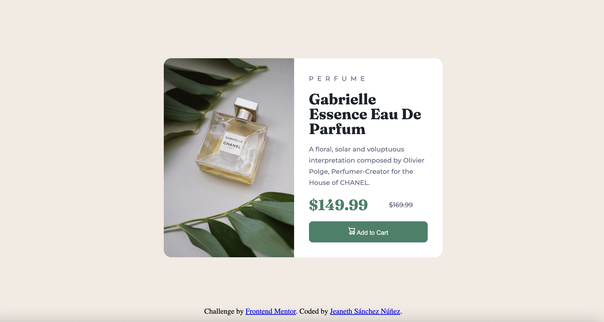

# Frontend Mentor - Results summary component solution

This is a solution to the [Results summary component challenge on Frontend Mentor](https://www.frontendmentor.io/challenges/product-preview-card-component-GO7UmttRfa/hub). Frontend Mentor challenges help you improve your coding skills by building realistic projects. 

## Table of contents

- [Overview](#overview)
  - [The challenge](#the-challenge)
  - [Screenshot](#screenshot)
  - [Links](#links)
- [My process](#my-process)
  - [Built with](#built-with)
  - [Continued development](#continued-development)
- [Author](#author)

## Overview

### The challenge

Users should be able to:

- View the optimal layout for the interface depending on their device's screen size

### Screenshot

### Links

- Solution URL: [https://github.com/jeanethsn/product-card-component](https://github.com/jeanethsn/product-card-component)
- Live Site URL: [https://jeanethsn.github.io/product-card-component/](https://jeanethsn.github.io/product-card-component/)

## My process

First, I created the entire HTML structure using sections and divs. Then, I defined all the color variables in the root, make all general styles, prepare fonts and finally, I began to write all the CSS, comparing it with the design image I had. I started with the desktop version and then moved on to the mobile version. I learn how to change images in css depending on the screen.

### Built with

- Semantic HTML5 markup
- CSS custom properties
- Flexbox

### Continued development

I want to learn more about grid positioning

## Author

- LinkedIn - [Jeaneth Sánchez Núñez](https://www.linkedin.com/in/jeaneth-sanchez/)
- Frontend Mentor - [@Gi1986](https://www.frontendmentor.io/profile/Gi1986)